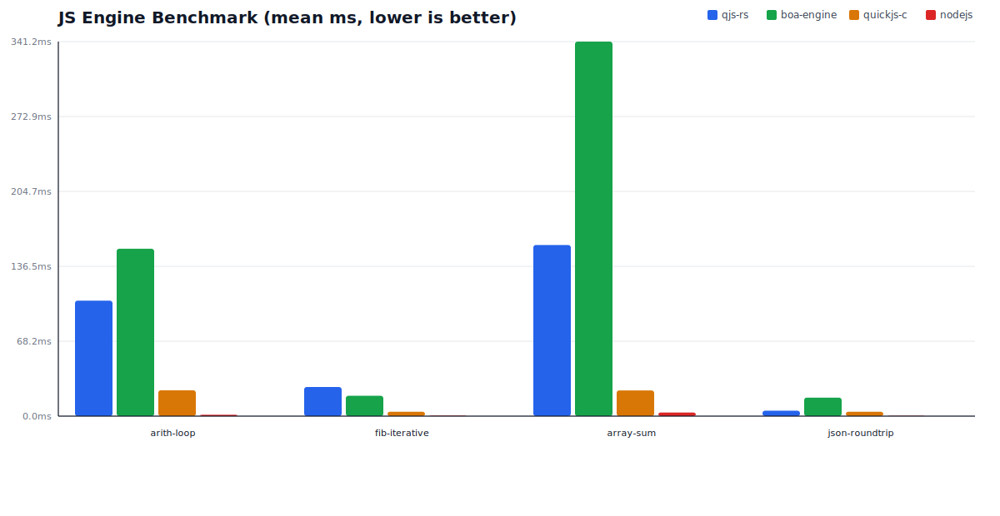

# Engine Benchmark Report

- Generated at: `2026-03-03T19:37:08.690Z`
- Host: `windows/x86_64`, logical CPUs: `16`
- Rust: `rustc 1.93.1 (01f6ddf75 2026-02-11)`
- Node.js: `v24.13.0`
- QuickJS(C): `QuickJS version 2025-09-13`

## Contract Metadata

- schema version: `bench.v1`
- run profile: `local-dev`
- timing mode: `eval-per-iteration`
- comparator strict mode: `True`
- output default path: `target/benchmarks/engine-comparison.local-dev.json`
- output effective path: `target/benchmarks/engine-comparison.local-dev.json`
- run controls: `iterations=200`, `samples=7`, `warmup_iterations=3`
- required engines: `qjs-rs, boa-engine, nodejs, quickjs-c`
- required cases: `arith-loop, fib-iterative, array-sum, json-roundtrip`

## Comparator Availability + Version Status

| Engine | Status | Command | Path | Workdir | Version | Reason |
|--------|--------|---------|------|---------|---------|--------|
| qjs-rs | available | `in-process` | `n/a` | `n/a` | `qjs-rs 0.1.0` | — |
| boa-engine | available | `in-process` | `n/a` | `n/a` | `boa-engine (in-process)` | — |
| quickjs-c | available | `qjs` | `scripts/quickjs-wsl.cmd` | `n/a` | `QuickJS version 2025-09-13` | — |
| nodejs | available | `node` | `C:\Program Files\nodejs\node.exe` | `n/a` | `v24.13.0` | — |

Unsupported/missing comparators are flagged above and shown as `N/A (status)` in the latency tables below.

## Mean Latency by Case (Lower is Better)

## Per-case Mean Latency

| Case | qjs-rs mean(ms) | boa-engine mean(ms) | quickjs-c mean(ms) | nodejs mean(ms) |
|------|-----------------:|--------------------:|-------------------:|---------------:|
| arith-loop | 105.189 | 152.489 | 23.571 | 1.287 |
| fib-iterative | 26.532 | 18.546 | 4.000 | 0.491 |
| array-sum | 155.907 | 341.186 | 23.429 | 3.306 |
| json-roundtrip | 4.952 | 16.844 | 4.000 | 0.353 |

## Aggregate Comparison

| Engine | Avg mean(ms) across cases | Relative vs qjs-rs (higher=faster) |
|--------|---------------------------:|------------------------------------:|
| qjs-rs | 73.145 | 1.000x |
| boa-engine | 132.266 | 0.553x |
| quickjs-c | 13.750 | 5.320x |
| nodejs | 1.359 | 53.812x |
